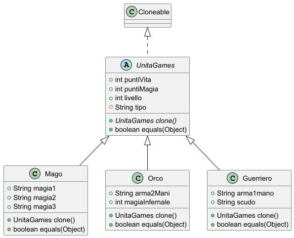

# 🤖 Prototype Pattern

## 📖 Descrizione

Il **prototype** è un pattern creazionale che permette la copia di oggetti esistenti rendendo il codice indipendente uno
dall'altro.

## 🤯 Problema

Per creare una copia esatta bisogna creare un nuovo oggetto e copiarne tutti i campi, che possono essere anche privati e
non visibili dall'esterno!

Inoltre, bisogna per forza conoscere la classe, quindi il codice diventa dipendente dalla classe stessa!

## 🧠 Intento

- Delegare il processo di clonazione agli oggetti effettivi che vengono clonati
- Disaccoppiare il codice dalla classe di quel oggetto da copiare

## 💡 Applicabilità

- Utilizzare Prototype quando il codice non deve dipendere dalle classi concrete degli oggetti che devono essere copiati
    - Questo si verifica in particolare con oggetti passati da terze parti tramite interfaccia
    - Le classi concrete di questi oggetti sono sconosciute e non si può fare affidamento su di esse
- Prototype fornisce al client un'interfaccia generale per lavorare con tutti gli oggetti che supportano la clonazione
    - In questo modo, si ha indipendenza dalle classi concrete degli oggetti che vengono clonati
- Utilizzare Prototype quando si vuole ridurre il numero di sottoclassi che differiscono solo nel modo in cui vanno a
  inizializzare i rispettivi oggetti

## ⚖️ Pro e Contro

- ✅ Clonazione oggetti senza accoppiamento alle classi concrete
- ✅ Eliminazione di codice di inizializzazione ripetuto
- ✅ Realizzazione facile di oggetti complessi
- ❌ Clonare oggetti complessi con riferimenti circolari può essere complesso

## 📐 UML

